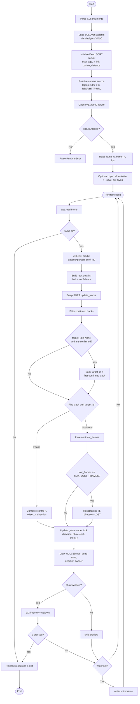
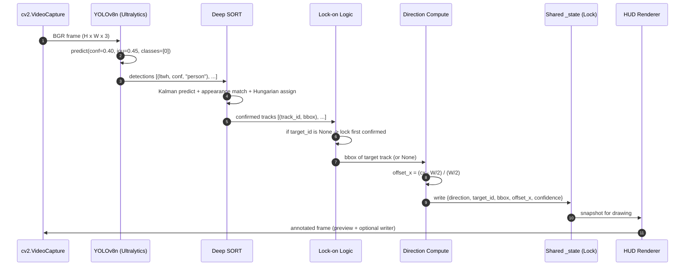
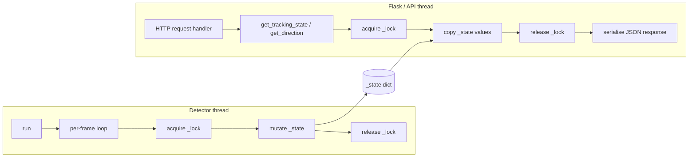

# Process Flow and Implementation of the Vision-Based Person-Following Module

*A technical documentation chapter describing the detection-and-tracking subsystem (`detect.py`) of the autonomous person-following robot.*

---

## 1. Abstract

This chapter documents the process flow, algorithmic composition, and software toolchain of the vision subsystem responsible for identifying a target individual in the camera field of view and producing a high-level steering command (`LEFT`, `RIGHT`, `CENTER`, or `LOST`) consumed by the downstream motion-control layer. The subsystem is implemented in a single Python module, `detect.py`, and combines a one-stage convolutional object detector (YOLOv8n) with a multi-object tracker (Deep SORT) to achieve persistent identity-aware tracking of a single locked target. The process is structured as a frame-synchronous pipeline composed of six sequential stages — frame acquisition, object detection, multi-object tracking, target lock-on, direction inference, and concurrent state publication — wrapped around a thread-safe shared-state object that decouples perception from the HTTP-facing API consumer.

---

## 2. Scope and Module Boundary

The documentation in this chapter is restricted to the vision-and-tracking pipeline as currently realised in source. The broader robotic system specification (LiDAR ranging, sensor fusion, and PID motion control) is intentionally out of scope; only the camera-side perception module is described here, because it is the only stage with an executable implementation at the time of writing.

The module's responsibilities are:

1. Acquire video frames from a configurable camera source.
2. Detect every person present in the frame.
3. Maintain persistent identities across frames so the same individual continues to be recognised.
4. Lock onto the first confirmed individual and treat that person as the follow target.
5. Translate the target's image-plane position into a discrete steering directive.
6. Publish that directive — together with auxiliary metadata — to consumers via a thread-safe accessor.

Everything outside these six responsibilities (motor commands, distance estimation, web serving, hardware initialisation) is the responsibility of other modules.

---

## 3. Software Toolchain

The implementation depends on a small, well-established stack of computer-vision and machine-learning libraries. The selection is justified below.

| Tool / Library | Version constraint | Role in the pipeline | Rationale for selection |
|---|---|---|---|
| **Python 3** | n/a | Host language | Standard glue for OpenCV, PyTorch, and ROS-adjacent robotics stacks; mature ecosystem on Raspberry Pi. |
| **Ultralytics YOLO** (`ultralytics`) | Latest | Object detection (Step A) — runs the YOLOv8n network | One-stage detector with state-of-the-art accuracy/latency trade-off on edge hardware; ships the `YOLO()` class which abstracts model loading and inference. |
| **YOLOv8n weights** (`yolov8n.pt`) | Pretrained on COCO | Detector network parameters | The "nano" variant is the smallest YOLOv8 model (~6 MB), suitable for a Raspberry Pi 4/5 class CPU; pretrained weights cover the COCO `person` class (class index 0). |
| **Deep SORT (Realtime)** (`deep_sort_realtime`) | Latest | Multi-object tracking (Step B) | Combines Kalman-filter motion prediction with a CNN-based appearance descriptor, producing identity-stable tracks that resist short occlusions and crossings. |
| **OpenCV** (`opencv-python`) | Latest | Frame capture, drawing, video I/O, preview window | De-facto standard for camera I/O and image manipulation in Python. |
| **PyTorch** (`torch`, `torchvision`) | Latest | Deep-learning runtime backing both YOLOv8 and Deep SORT's appearance encoder | Required dependency of the two preceding libraries. |
| **NumPy** (`numpy`) | Latest | Numerical handling of bounding-box coordinates | Standard array library. |
| **Flask + Flask-CORS** | Listed in `requirements.txt` | Reserved for the API layer (`api.py`) — not used by the detector itself | Listed for completeness; the perception module exposes its state through a thread-safe Python accessor that the Flask layer will read. |
| **Python `threading.Lock`** | stdlib | Mutual exclusion on the shared `_state` dictionary | Allows the detector loop and the API thread to coexist safely. |

The combination YOLOv8 + Deep SORT was chosen because it directly addresses the two distinct sub-problems posed by person-following: *what is in the frame* (detection) and *which one is "the" person we have committed to follow* (identity-stable tracking).

---

## 4. High-Level Process Flow

The module operates as a single-threaded perception loop fed by an OpenCV video capture handle. The lifetime of a single execution can be partitioned into a one-time **initialisation phase** and a repeated **per-frame phase**.



*Figure 4.1 – End-to-end process flow of `detect.py`.*

---

## 5. Initialisation Phase

The initialisation phase runs exactly once per program invocation and prepares the three external resources that the per-frame loop will rely on: the detector network, the tracker state machine, and the video source.

### 5.1 Detector load

The detector is instantiated by `model = YOLO("yolov8n.pt")`. The Ultralytics library will, on first run, download the weight file if it is not present in the working directory. The same call constructs the underlying PyTorch graph and moves it to the available device (CPU on a stock Raspberry Pi; CUDA if a compatible GPU is present). After this point the detector is ready for inference and need not be reloaded.

### 5.2 Tracker initialisation

The Deep SORT tracker is constructed with the following hyperparameters:

| Parameter | Value | Meaning |
|---|---|---|
| `max_age` | `MAX_LOST_FRAMES = 30` | Number of consecutive frames a track may remain unmatched before being deleted by the tracker. |
| `n_init` | `3` | Number of consecutive matched frames required before a tentative track is promoted to a *confirmed* track. |
| `nms_max_overlap` | `1.0` | Disables the tracker's internal non-maximum suppression in favour of YOLO's NMS. |
| `max_cosine_distance` | `0.3` | Maximum cosine distance in the appearance-feature space for two detections to be considered the same identity. |
| `nn_budget` | `100` | Maximum number of appearance descriptors retained per identity for the cosine-distance gallery. |

The combination of `n_init = 3` and a relatively strict cosine threshold yields tracks that are slightly slower to appear but markedly less prone to false-positive ID swaps — a property that is essential for the lock-on logic in Section 7.

### 5.3 Camera source resolution

The camera source is determined by precedence: an explicit `--source` CLI argument (camera index, RTSP URL, HTTP MJPEG URL, or local video file path) overrides the in-file `CAMERA_MODE` constant, which in turn selects between a local webcam (index 0) and an IP camera URL. The resolved source is passed to `cv2.VideoCapture`. Frame width, frame height, and source FPS are queried up-front and used both for direction computation and for the optional `cv2.VideoWriter` annotated-output sink.

---

## 6. Per-Frame Pipeline

After initialisation the module enters its main loop. Every iteration corresponds to a single video frame and is composed of six logical stages.



*Figure 6.1 – Per-frame data flow between the cooperating components.*

### 6.1 Stage 1 — Frame acquisition

`cap.read()` returns a `(retval, frame)` pair. `frame` is a NumPy array in OpenCV's native BGR colour order. A `False` retval indicates either end-of-stream (for a file source) or a transient capture failure (for a network source); the loop terminates in either case. A frame counter `frame_idx` is incremented for each successfully captured frame and is later used to compute average throughput.

### 6.2 Stage 2 — Detection (YOLOv8n)

The frame is fed to the detector via:

```python
results = model.predict(
    frame,
    conf=conf_thresh,    # 0.40 by default
    iou=iou_thresh,      # 0.45 by default
    classes=[PERSON_CLASS_ID],   # COCO id 0
    verbose=False,
)[0]
```

The call returns a single `Results` object containing zero or more bounding boxes restricted to the COCO `person` class. Boxes are filtered server-side by the `conf` threshold; the IoU threshold drives non-maximum suppression. Each surviving box is unpacked into the `(x1, y1, x2, y2)` corners and the scalar confidence, then converted to the `(left, top, width, height)` format expected by the Deep SORT API:

```python
raw_dets.append(([x1, y1, w, h], conf, "person"))
```

Restricting detection to a single class lowers latency (post-processing iterates a much smaller candidate set) and eliminates an entire class of cross-class false positives.

### 6.3 Stage 3 — Multi-object tracking (Deep SORT)

The list of raw detections, together with the original frame, is handed to:

```python
tracks = tracker.update_tracks(raw_dets, frame=frame)
```

Deep SORT performs three operations per call:

1. **Motion prediction** — each existing track's Kalman filter advances its state by one time step, producing a predicted bounding box.
2. **Appearance encoding** — a small CNN extracts a feature vector from each detection's image patch (this is why the original `frame` must be passed in alongside the detections).
3. **Association** — the Hungarian algorithm assigns detections to tracks using a cost matrix that combines Mahalanobis motion distance and cosine appearance distance. Unmatched detections seed *tentative* tracks; tentative tracks promote to *confirmed* after `n_init = 3` consecutive matches; confirmed tracks that go unmatched for more than `max_age = 30` frames are deleted.

Only confirmed tracks are considered downstream:

```python
confirmed = [t for t in tracks if t.is_confirmed()]
```

This filter is critical — it is what prevents the lock-on stage from latching onto a noisy single-frame detection.

### 6.4 Stage 4 — Target lock-on

The module follows a single individual at a time. The lock-on rule is deliberately simple:

> *If no target is currently held and at least one confirmed track exists in the current frame, lock onto the first track in the confirmed-tracks list returned by Deep SORT in that frame.*

In code:

```python
if target_id is None and confirmed:
    target_id = confirmed[0].track_id
```

Once `target_id` is set it is preserved across frames as long as the tracker continues to report a confirmed track carrying the same ID (the per-frame search is `next((t for t in confirmed if t.track_id == target_id), None)`). The "first confirmed" heuristic exploits the fact that Deep SORT assigns IDs monotonically, so in practice the earliest-seen stable person becomes the target. More elaborate lock-on policies (largest bounding box, smallest distance to frame centre, manual selection) are possible extensions but are not implemented here.

### 6.5 Stage 5 — Direction computation

If a track matching `target_id` is present in the current frame, its centre x-coordinate is converted to a normalised horizontal offset and then quantised to one of four direction tokens:

$$
\text{offset}_x = \frac{c_x - W/2}{W/2}, \qquad c_x = \frac{x_1 + x_2}{2}
$$

where $W$ is the frame width and $c_x$ is the x-coordinate of the target bounding-box centre. The offset lies in $[-1, +1]$, where $-1$ corresponds to the extreme left edge and $+1$ to the extreme right edge of the frame.

A symmetric *dead-zone* of width $\pm \text{DEAD\_ZONE\_RATIO}$ (default $\pm 0.15$) around zero suppresses jitter when the target is approximately centred:

$$
\text{direction} =
\begin{cases}
\text{LEFT}   & \text{if } \text{offset}_x < -0.15 \\
\text{RIGHT}  & \text{if } \text{offset}_x > +0.15 \\
\text{CENTER} & \text{otherwise}
\end{cases}
$$

Implemented as:

```python
def _compute_direction(cx, frame_w):
    centre = frame_w / 2.0
    offset_x = (cx - centre) / centre
    if offset_x < -DEAD_ZONE_RATIO: return "LEFT", offset_x
    if offset_x >  DEAD_ZONE_RATIO: return "RIGHT", offset_x
    return "CENTER", offset_x
```

The dead-zone is the sole hysteresis mechanism in the module. Without it the steering directive would oscillate between `LEFT` and `RIGHT` whenever a person stood near the optical axis — undesirable both for visual presentation and, downstream, for motor control.

### 6.6 Stage 6 — Confidence back-association

Deep SORT's track objects carry no detection confidence by themselves (they expose the smoothed Kalman state, not the raw detection). To preserve the YOLO confidence for the locked target — useful for the API consumer and for telemetry — the module re-associates the tracked bounding box with its source detection by spatial proximity:

```python
for box in results.boxes:
    rcx, rcy = bbox-centre of YOLO detection
    tcx, tcy = bbox-centre of tracked target
    if |rcx - tcx| < 40 and |rcy - tcy| < 40:
        best_conf = max(best_conf, float(box.conf[0]))
```

The 40-pixel L∞ tolerance is empirical and assumes the detector and tracker agree closely on bounding-box centres after Kalman smoothing.

### 6.7 Stage 7 — Lost-target handling

If no confirmed track in the current frame carries the held `target_id`, the module increments `_state["lost_frames"]`. While this counter is below `MAX_LOST_FRAMES`, the previously published direction is preserved (the consumer continues to act on the last-known command). When the counter reaches the threshold the module declares the target lost: `target_id` is cleared, `direction` is set to `LOST`, and the bounding box is dropped. The lock-on rule (Section 6.4) will then fire again on the next frame that contains a confirmed track, effectively re-acquiring whichever stable person appears next.

The dual use of `MAX_LOST_FRAMES` — both as Deep SORT's `max_age` and as the module-level lost-target threshold — guarantees that the tracker's internal track lifetime and the module's external lock lifetime expire on the same frame, eliminating an entire class of edge-case bugs in which the tracker had already deleted a track while the module still believed it to be live.

---

## 7. Concurrency Model

The detector loop is intended to coexist with an HTTP API thread (planned `api.py`) that exposes the current direction over a network socket. Because the two threads must read and write a shared structure — `_state` — without corrupting it, all access is serialised by a module-level `threading.Lock`:



*Figure 7.1 – Producer/consumer relationship over the shared `_state` dictionary.*

Two public accessors are provided. Both follow the same idiom of acquiring the lock, taking a snapshot, and releasing the lock before returning, so the caller never holds the lock for any length of time:

| Function | Returns | Intended consumer |
|---|---|---|
| `get_tracking_state()` | `dict` containing `direction`, `target_id`, `bbox`, `offset_x`, `confidence`, `lost_frames` | Any module that needs the full perception snapshot. |
| `get_direction()` | `str` — one of `LEFT`, `RIGHT`, `CENTER`, `LOST` | Lightweight steering consumers (e.g., the eventual motion-control loop). |

Because `_state` is mutated only inside `run()`, and only ever in one place per iteration, the producer side has no internal contention; the lock exists exclusively to defend against torn reads by the API thread.

---

## 8. Configuration Surface

All tunable parameters are surfaced either as module-level constants or as CLI flags. The complete configuration surface is summarised below.

| Parameter | Where defined | Default | Effect |
|---|---|---|---|
| `CAMERA_MODE` | module constant | `"laptop"` | Selects between local webcam (`"laptop"`) and IP camera (`"ipcam"`). Overridable via `--source`. |
| `IP_CAM_URL` | module constant | RTSP placeholder | Used when `CAMERA_MODE == "ipcam"` and `--source` is not supplied. |
| `SHOW_WINDOW` | module constant | `True` | Default value of `--show`. Disable for headless Raspberry Pi operation. |
| `PERSON_CLASS_ID` | module constant | `0` | COCO class index. Should not normally be changed. |
| `DEAD_ZONE_RATIO` | module constant | `0.15` | Half-width of the centre dead-zone, expressed as a fraction of frame width. |
| `MAX_LOST_FRAMES` | module constant | `30` | Frames of consecutive non-detection before the target is declared lost. Reused as Deep SORT's `max_age`. |
| `--source` | CLI flag | `None` | Camera index, RTSP/HTTP URL, or video file path. Overrides `CAMERA_MODE`. |
| `--conf` | CLI flag | `0.40` | YOLOv8 detection confidence threshold. |
| `--iou` | CLI flag | `0.45` | YOLOv8 NMS IoU threshold. |
| `--show` / `--no-show` | CLI flag | `SHOW_WINDOW` | Enable or disable the OpenCV preview window. |
| `--save_out` | CLI flag | `None` | If set, the annotated output stream is written to the given video file. |

---

## 9. Output and Visualisation

When `--show` is enabled the module renders a heads-up display on each frame containing: every confirmed track's bounding box (target highlighted in green, others in grey); the dead-zone vertical lines; the optical-axis vertical line; and a coloured banner displaying the current direction. The same annotated frames are optionally written to disk via `cv2.VideoWriter` when `--save_out` is supplied. Visualisation is strictly observational — it has no side effects on the perception state.

On clean shutdown (end of stream, `q` keypress, or unhandled exception) the capture handle, optional writer, and OpenCV windows are released, and a one-line summary reports the average throughput in frames per second.

---

## 10. Performance and Limitations

The pipeline is bounded in throughput by the slower of the two neural inferences per frame: YOLOv8n on the host CPU/GPU and Deep SORT's appearance encoder on the host CPU/GPU. Both are sub-real-time on a stock Raspberry Pi 4 and approach 25–30 FPS on a modest discrete GPU. Three known limitations follow from the current design:

The lock-on heuristic is *first-come-first-served*: if a non-target person is the first to be confirmed by Deep SORT, the robot will follow them. In a real deployment this would be replaced by an explicit selection step (manual click, gesture, or a re-identification model trained on the operator). The direction signal is *image-plane only* and therefore conveys no information about the target's distance; the planned LiDAR fusion stage is the intended remedy. The dead-zone is *symmetric and frame-relative*: at very short range or with a wide-angle lens a small lateral movement of the target produces a large `offset_x`, so the dead-zone in metric terms shrinks as the person approaches. A range-aware, distance-scaled dead-zone is a natural extension once LiDAR data becomes available.

---

## 11. Summary

The detection-and-tracking module realises a tightly scoped perception pipeline whose only externally visible contract is a thread-safe accessor returning one of four direction tokens. Internally the module composes three classical components — a YOLOv8n object detector, a Deep SORT identity tracker, and a normalised-offset direction quantiser — into a deterministic per-frame state machine guarded by a single mutex. The design intentionally trades sophistication for predictability: every stage has a single responsibility, every parameter has a single home, and every transition between `LEFT`, `RIGHT`, `CENTER`, and `LOST` can be traced to an explicit condition in source. This minimalism is what will allow the subsequent fusion and control stages to be added without disturbing the perception layer.
